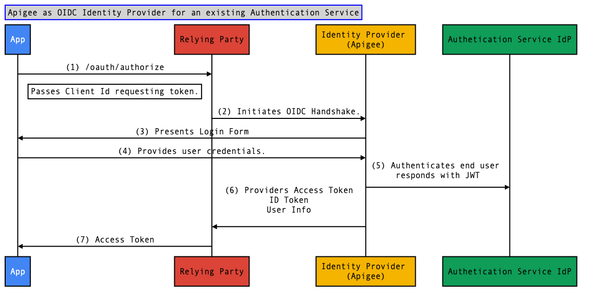
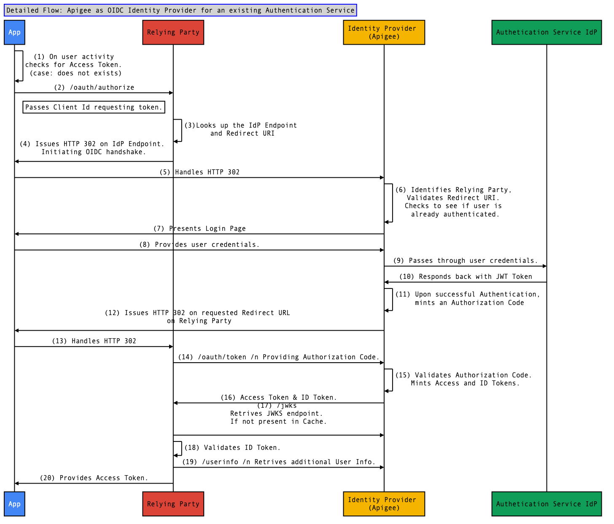

# Apigee as OIDC Identity Provider for an existing Authentication Service.

A deployable solution implementing the [end-user Authentication for API Access Reference Architecture](https://apigeedemo.net/config)

## Solution Architecture: 

### Architecture Modules

**Authentication Service** :

Authentication Service module provides end user authentication leveraging user credentials. The service authenticates end user credentials and returns a JWT upon successful authentication. Typically this is an intranet service abstracting underlying Identity Store like Active Directory, LDAP or SQL/NoSQL User DB.

**OIDC Identity Provider Service** :

Apigee abstracts the above **Authentication Service** and provides an OIDC Identity Provider Interface. This OIDC interface provides consistent standards based authentication for all Mobile and Web apps across enterprise. Upon successful installation of this solution you will have Apigee providing the following:

- [OIDC Well Known Configuration](https://openid.net/specs/openid-connect-discovery-1_0.html#ProviderConfig).
- [OIDC JWKS Endpoint](https://tools.ietf.org/html/draft-ietf-jose-json-web-key-41#appendix-A.1)
- [OIDC Authorize and Token Interfaces](https://openid.net/specs/openid-connect-core-1_0.html#CodeFlowAuth) 

**User Agent Module** : 

User Agent can be a Browser App (Single Page App, Smart Client based App) or a Native Mobile App.

**OIDC Relying Party** : 

Module that initiates the OIDC handshake to authenticate end user. It is the Relying Party that exchanges OIDC Identity Provider issued Authorization Code with **Access Token** and **Id Token**.

## Simplified Solution Flow Diagram

|  |
|--------------------------|
||
| |

**Sequence flow**:

**Step 1** : End user initiates Application activity. This could be the very first time end-user accesses the App. App checks if the Access_Token is already present. In this case this check fails (initial activity) and App starts an Access_Token request against Relying Party. 

**Step 2**: Relying Party looks up the configured Identity Provider. Based on the Identity Providers metadata, Relying Party initiates a OpenId Connect handshake.

**Step 3**: Identity Provider presents a Login Form to the end user. (Typically Identity Provider checks if the user is already authenticated based on an already injected Cookie). 

**Step 4**: User enters credentials and passes them to Identity Provider for authentication.

**Step 5**: Identity Provider invokes the configured backend Authentication Service passing the needed credentials. Authentication Service authenticates end user and provides a JWT token with needed information about the user.

**Step 6**: Leveraging the Authentication Service provided JWT token, Identity Provider provides Access Token, ID Token and User Info to Relying Party.

**Step 7**: Relying Party concludes the OIDC handshake by Validating the issued ID Token. Replying Party send the Access Token to App. Using this Access Token, App can now access APIs.

## Detailed Architecture Diagram

| Detailed Solution Flow |
|--------------------------|
||
| |

## Pre-Requisites:  
#### Identity Provider Configuration
1. As OIDC Identity Provider this module generates RSA signed JWT based ID Token. You need to provide the RSA key information in JWKS format. You can use [node based pem-to-jwk](https://www.npmjs.com/package/rsa-pem-to-jwk) package to generate the needed "n", "e" parameters.
2. Ensure you have the Authentication Service endpoint ready, that takes end user credentials and returns JWT token. Also note the user attributes embeded in JWT, you will need to map these user attributes in __EV_CICP_Login_Response__ policy.
3. Ensure you have [Maven](https://maven.apache.org/) installed and is configured in the PATH variable on your terminal.
4. Ensure you have [Node and NPM](https://nodejs.org/en/) installed and configured in the PATH variable on your terminal.
5. Ensure you have Relying Party Module ready to be configured with this Identity Provider module. You can also use [this apigee based Relying Party](https://github.com/nas-hub/enduser-authentication-for-api-access-via-oidc) solution.

#### You will need the following information for configuring the :

Update the following properties 
| Property |  Description |
|  :---: | :-- |
| **jwks.n.value** | Below JWKS n, e, use, kty attributes are defined in [JWKS Specs](https://tools.ietf.org/html/rfc7517#section-9.3).   Ensure the n value is in single line.  You can use [node based pem-to-jwk](https://www.npmjs.com/package/rsa-pem-to-jwk) package to generate the needed "n", "e" parameters. |
| **jwks.e.value** | e value following the above instructions.|
| **jwks.use.value** | use must be set to signature verification with value __sig__ |
| **jwks.kty.value** | Key Type supported by this solution is __RSA__ |
| **jwt.signature.private_key.value** |For security purpose let us not add the PEM formated Private Key at this step. Once th package is loaded on Apigee, this field must be updated in KVM directly with PEM encoded private key.
 |

#### Apigee Account Registration:
You will need to register for a trial version of Apigee or have access to an Apigee Enterprise Organization.  You will need following details about your Apigee Account :-
- Apigee Organization Name
- Apigee Environment Name
- Apigee Organization Admin Account Username
- Apigee Organization Admin Account Password

Ensure you have access to your Apigee Organization where you want to deploy this solution.

#### Maven In Path: 
Make sure you have installed and configured Maven in the path.

#### NPM and Node: 
You will need to install NPM version 6.X or higher and Node Version 10.X or higher

## Installation Instruction: 

The above solution is provided as a package as part of this project and can be configured following the below steps:
- Clone the repo `git https://github.com/nas-hub/enduser-authentication-for-api-access-via-oidc`
- Navigate to IdP_Pattern_1B_OIDC directory - `cd IdP_Pattern_1A_OIDC`
- Update the IDP configurations in the [config.properties](./config.properties)
- Execute `npm install`
- Execute `node setup.js` and follow the prompts

 
**node setup.js prompts**

| prompt |  Description |
|  :--- | :-- |
| **Please provide the Apigee Edge Organization name:** | Enter your Apigee Org Name.  |
| **Please provide the Apigee Edge Environment name:** |  Enter your Apigee Org's environment where these policies will be deployed. |
| **Please provide the Proxy name** | Enter a descriptive name for this new proxy.  |
| **Please provide the Proxy basepath** | Enter the base path for this new proxy.  |
| **Please provide the Apigee KeyValueMap name where the IDP configurations will be stored** | Enter the name of new KVM (Key Value Map) that will be created to store Identity Provider details provided in the config.properties  |
| **Please provide the Apigee Edge username** |  Enter your Apigee Username |
| **Please provide the Apigee Edge password** |  Enter your Apigee password |
| | |

**Success** Upon successful deployment of this proxy, the *node setup.js* should provide you with a json config file under the **target** folder. 

At this point the solution should be deployed on your Apigee Org, and should be ready for use. Follow below steps to see the solution working end to end.

### Testing the Solution

1. Go to [Config Apigee Demo App](https://apigeedemo.net/config)
2. Click the **Import** button on top right corner to import the above generated json config file.
3. Click Update after importing the json config file.
4. You should be on login page that has Login button.
5. Clicking the Login Button will initiate a OIDC based login with your Identity Provider via Apigee. You can also turn on the **trace** for this proxy on Apigee to see the proxy functionality.
6. At this point you should have Access Token issued by Apigee and should be able to introspect the token, as well as invoke APIs with this token.

### Report Issues
 
 [Please report issues here](https://github.com/nas-hub/enduser-authentication-for-api-access-via-oidc/issues/new)

